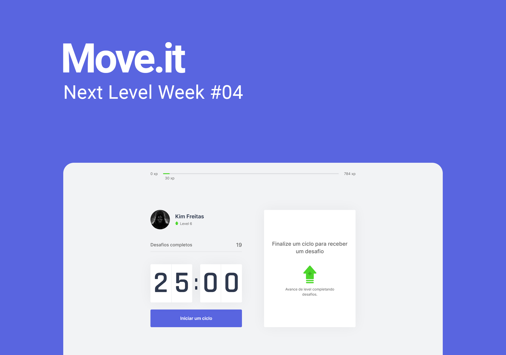

<h1 align="center">
  
</h1>

<p align="center">O move.it é um app que une a técnica de Pomodoro com a realização de exercícios físicos para quem passa muito tempo na frente do computador.</p>

<p align="center">
    <a href="README.md">Inglês</a>
    ·
    <a href="README-pt.md">Português</a>
</p>

<br>

<p align="center">

  <a href="https://github.com/Darrooooow">
    &logo=github" alt="Made by Darrow" title="Made by Darrow">
  </a>

  <a aria-label="NLW 04" href="https://nextlevelweek.com/">
    </img>
  </a>

  &logo=" alt="License" title="License">

  <a href="https://github.com/Darrooooow/Move.it-NLW-04/commits/main">
    
  </a>

  
</p>

<br>
<br>
<br>


## Topics

* [Sobre o projeto](#sobre-o-projeto)

* [Layout](#layout)

* [Demo](#demo)

* [Tecnologias](#Tecnologias)

* [Como executar](#como-executar)

* [Licença](#licença)

<br>

## Sobre o projeto

Este projeto foi desenvolvido durante a Next Level Week #04 da <a href="https://rocketseat.com.br/">Rocketseat</a>.

<p align="center">
  
</p>

The Move.it is an app that combines the Pomodoro technique with physical exercises for those who spend a lot of time in front of the computer.

## Layout

Veja o layout no Figma.
<br>
<br>
<a href="https://www.figma.com/file/ScJHqqEWYjRGlTfeeYc4Et/Move.it-1.0-(Copy)?node-id=160%3A2761">
  
</a>


## Demo

Veja uma demo real na Vercel.

[](https://moveit-darrow.vercel.app/)
## Tecnologias

* <a href="https://reactjs.org/">ReactJS</a>
* <a href="https://www.typescriptlang.org/">TypeScript</a>
* <a __blank href="https://nextjs.org/">Next.js</a>

## Como executar

É importante ter o <a href="https://yarnpkg.com/">Yarn</a> instalado no seu computador.

```bash
# Abra um terminal e copie este repositório com o comando
$ git clone https://github.com/Darrooooow/Move.it-NLW-04.git

# Entre na pasta com 
$ cd Move.it-NLW-04

# Instale as dependências
$ yarn install

# Rode o aplicação
$ yarn dev

# Agora você pode acessar localhost:3000 do seu navegador.
```
## Licença

Esse projeto está sob a licença MIT. Veja o arquivo <a href="https://github.com/Darrooooow/Move.it-NLW-04/blob/main/LICENSE.md">LICENSE</a> para mais detalhes.

Feito com amor por <a href="https://github.com/Darrooooow">Darrow</a>.